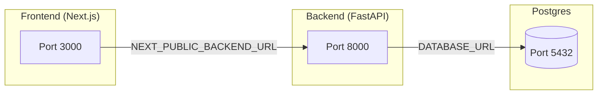

# MVPHRM (Minimum Viable Product Human Resource Management System)

## Overview
MVPHRM is a lightweight HRMS Lite application designed to help administrators manage employee records and track daily attendance. It is built with a modern full-stack architecture and follows industry best practices for modular design, containerized deployment, and maintainability.

## Tech Stack
- **Frontend:** Next.js (React, App Router, `/src` directory, ESLint, React Compiler, alias `@/*`)
- **Backend:** FastAPI (Python, modular structure with `api`, `models`, `schemas`, `services`, `core`)
- **Database:** PostgreSQL (containerized, initialized via `db/init.sql`, migrations managed with Alembic)
- **Orchestration:** Docker Compose
- **Deployment:** 
  - Frontend → Vercel
  - Backend → Render
  - Database → Managed Postgres or containerized Postgres

## Architecture Overview
- **Frontend (Next.js)**: Provides UI with App Router, React Query for API state, and Context/Zustand for UI state.
- **Backend (FastAPI)**: Exposes RESTful APIs for employee and attendance management, connected to PostgreSQL.
- **Database (PostgreSQL)**: Stores employee and attendance records, initialized with `init.sql` and evolved via Alembic migrations.
- **Docker Compose**: Orchestrates services (frontend, backend, db) with environment variables for configuration.
- **Deployment**: Frontend on Vercel, Backend on Render, Database managed via containerized Postgres or cloud provider.

## Project Structure
```
MVPHRM/
├── backend/
│   ├── app/
│   │   ├── api/            # routers/endpoints
│   │   ├── core/           # config, db, lifespan
│   │   ├── models/         # SQLAlchemy ORM models
│   │   ├── schemas/        # Pydantic schemas
│   │   ├── services/       # business logic
│   │   ├── migrations/     # Alembic migration scripts
│   │   ├── utils/          # validation helpers
│   │   └── main.py         # FastAPI entrypoint
│   ├── Dockerfile
│   ├── requirements.txt
│   └── tests/
├── db/
│   ├── Dockerfile          # Postgres container
│   └── init.sql            # schema bootstrap
├── docker-compose.yml
├── frontend/
│   ├── src/                # Next.js app router, components, hooks, context
│   ├── Dockerfile
│   └── package.json
├── README.md
└── run.sh
```

## Network & Service Communication
All services run on a shared custom Docker network (`mvphrm_net`).  
This allows containers to resolve each other by service name (`frontend`, `backend`, `db`) instead of IP addresses.



### Explanation
- **Frontend (Next.js)**  
  - Runs on port `3000`.  
  - Calls backend APIs using `NEXT_PUBLIC_BACKEND_URL`.  

- **Backend (FastAPI)**  
  - Runs on port `8000`.  
  - Connects to Postgres using `DATABASE_URL`.  
  - CORS configured to allow requests from `FRONTEND_URL` and `FRONTEND_URL_PROD`.  

- **Database (Postgres)**  
  - Runs on port `5432`.  
  - Credentials (`POSTGRES_USER`, `POSTGRES_PASSWORD`, `POSTGRES_DB`) passed via `.env`.  

- **Network (`mvphrm_net`)**  
  - Ensures all services can resolve each other by name.  
  - Example: backend connects to `db:5432`, frontend calls `backend:8000`.  

## Setup Steps
1. Clone the repository.
2. Copy `.env.example` to `.env` and fill in required values:
   ```env
   # Database
   POSTGRES_USER=mvphrm
   POSTGRES_PASSWORD=supersecret_prod_pass
   POSTGRES_DB=mvphrm_db
   DATABASE_URL=postgresql+asyncpg://${POSTGRES_USER}:${POSTGRES_PASSWORD}@db:5432/${POSTGRES_DB}

   # Backend
   PORT=8000
   FRONTEND_URL=http://localhost:3000
   FRONTEND_URL_PROD=https://mvphrm-frontend.vercel.app

   # Frontend (Next.js requires NEXT_PUBLIC_ prefix)
   NEXT_PUBLIC_BACKEND_URL=http://localhost:8000
   ```
   > ⚠️ **Important:** Never commit `.env` to version control.
3. Run `./run.sh start` to build and start all services.
4. Access the frontend at `http://localhost:3000` and backend at `http://localhost:8000`.

## Environment Variable Separation
To keep containers secure and lean, each service only receives the variables it needs:

- **Frontend (Next.js)**  
  - `NEXT_PUBLIC_BACKEND_URL` → exposed to browser for API calls.  
- **Backend (FastAPI)**  
  - `DATABASE_URL`, `PORT`, `FRONTEND_URL`, `FRONTEND_URL_PROD`.  
- **Database (Postgres)**  
  - `POSTGRES_USER`, `POSTGRES_PASSWORD`, `POSTGRES_DB`.  

This separation ensures:
- No secrets are leaked to services that don’t need them.  
- Frontend only exposes safe, prefixed variables.  
- Backend and Alembic migrations share the same `DATABASE_URL`.  

## Database & Migrations Workflow
- **Bootstrap:** `db/init.sql` runs automatically when the Postgres container is first created (local dev).
- **Migrations:** Use Alembic (`backend/app/migrations/`) for schema changes:
  ```bash
  alembic revision --autogenerate -m "Add new table"
  alembic upgrade head
  ```
- **Config:** `backend/app/alembic.ini` references `${DATABASE_URL}` so migrations and backend share the same connection string.

## Assumptions & Limitations
- Designed as an MVP: limited to employee and attendance management.
- Authentication and role-based access control are not included in this version.
- Deployment assumes Vercel (frontend) and Render (backend). Database can be containerized or managed externally.
